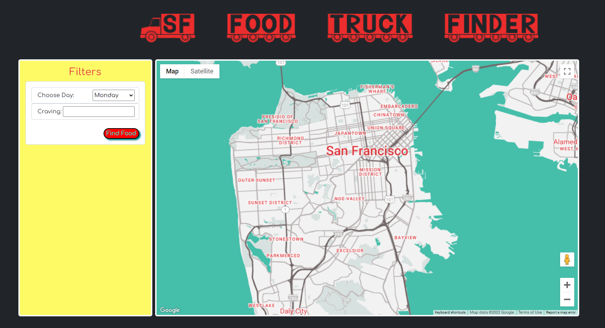
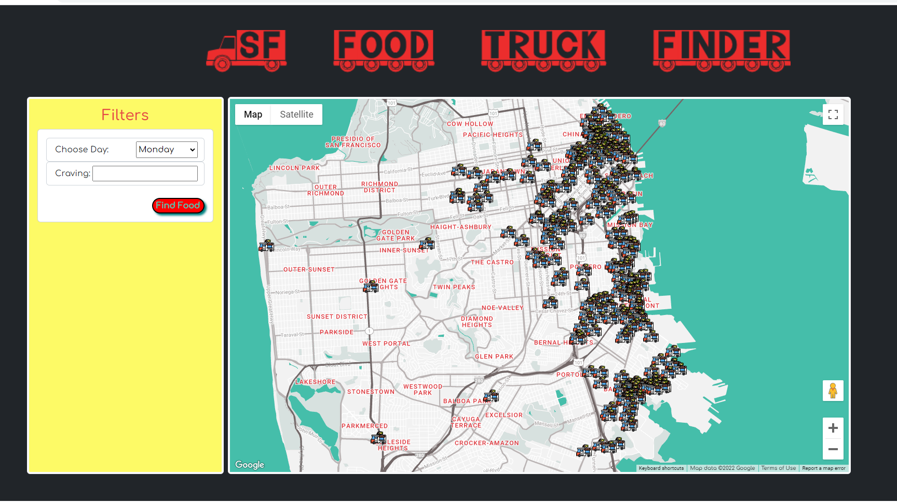
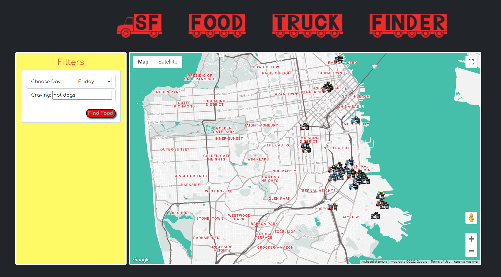

# SF-Food-Truck-Finder
San Francisco Food Truck Finder uses San Francisco Data API, powered by Socrata (https://dev.socrata.com/foundry/data.sfgov.org/bbb8-hzi6)
to display and track food trucks on Google Maps. Users can select the day of the week and/or type in a craving to display food truck markers that contain the names of the food trucks, hours of operation, street addresss and items sold.

##### Displays Google Map (styled with [snazzy maps](https://snazzymaps.com/))

##### Can filter food trucks by day of week

##### Can filter food trucks by day of week and craving

